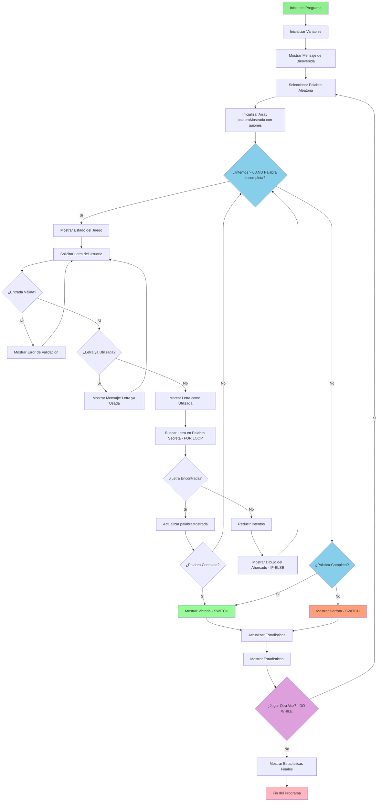

# Diagrama de Flujo - Juego del Ahorcado

Este diagrama muestra la lógica completa del juego del Ahorcado implementado en Java.

## Descripción del Flujo

1. **Inicio**: El programa comienza inicializando variables y mostrando el mensaje de bienvenida
2. **Selección de Palabra**: Se selecciona aleatoriamente una palabra del array predefinido
3. **Bucle Principal**: Se ejecuta mientras el jugador tenga intentos y la palabra esté incompleta
4. **Validación de Entrada**: Se valida que la letra ingresada sea correcta y no haya sido usada
5. **Procesamiento**: Se verifica si la letra está en la palabra secreta
6. **Actualización**: Se actualiza el estado del juego según el resultado
7. **Finalización**: Se muestra el resultado y se pregunta si quiere jugar otra vez

## Estructuras de Programación Implementadas

- **while**: Bucle principal del juego
- **for**: Inicialización y búsqueda de letras
- **do-while**: Validación de entrada del usuario
- **switch**: Procesamiento del resultado de la partida
- **if-else**: Múltiples decisiones condicionales
- **Arrays**: Almacenamiento de palabras y estado del juego
- **Matrices**: Representación del dibujo del ahorcado

## Leyenda de Colores

- 🟢 **Verde**: Inicio del programa
- 🔵 **Azul**: Puntos de decisión importantes
- 🟢 **Verde claro**: Victoria del jugador
- 🟠 **Naranja**: Derrota del jugador
- 🟣 **Púrpura**: Decisión de continuar jugando
- 🔴 **Rosa**: Fin del programa

## Requisitos Técnicos Destacados

### Tres Estructuras de Repetición
1. **WHILE**: Bucle principal (nodo F)
2. **FOR**: Búsqueda de letras (nodo N)
3. **DO-WHILE**: Validación de entrada (nodo Y)

### Control de Selección Múltiple
1. **SWITCH**: Procesamiento de resultados (nodos R y V)
2. **IF-ELSE**: Validación y mensajes (nodos I, K, T)

### Arrays y Matrices
- Array de palabras posibles
- Array para mostrar palabra actual
- Array booleano para letras utilizadas
- Matriz para dibujos ASCII del ahorcado 