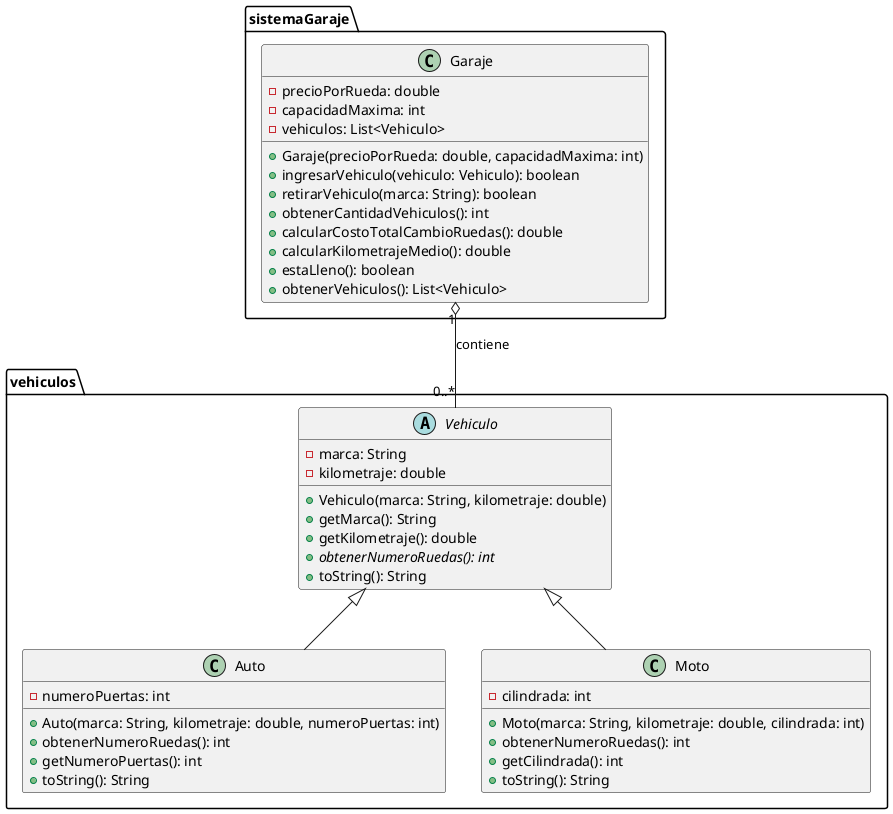

# Diagrama UML de Clases - Sistema de Gestión de Garaje

**Autor:** Albert Lukmanov  
**Email:** albert.lukmanov@davinci.edu.ar

---

## Descripción del Diagrama

El diagrama UML representa la estructura del sistema de gestión de garaje mediante cuatro clases principales organizadas en dos paquetes.

### Paquete: `vehiculos`

#### Clase `Vehiculo` (Abstracta)
- **Tipo:** Clase abstracta
- **Atributos:**
  - `- marca: String` - Marca del vehículo
  - `- kilometraje: double` - Kilometraje acumulado
  
- **Métodos:**
  - `+ Vehiculo(marca: String, kilometraje: double)` - Constructor
  - `+ getMarca(): String` - Obtener marca
  - `+ getKilometraje(): double` - Obtener kilometraje
  - `+ obtenerNumeroRuedas(): int {abstract}` - Método abstracto para número de ruedas
  - `+ toString(): String` - Representación textual

#### Clase `Auto`
- **Tipo:** Clase concreta
- **Herencia:** Extiende `Vehiculo`
- **Atributos específicos:**
  - `- numeroPuertas: int` - Cantidad de puertas del automóvil
  
- **Métodos:**
  - `+ Auto(marca: String, kilometraje: double, numeroPuertas: int)` - Constructor
  - `+ obtenerNumeroRuedas(): int` - Retorna 4 (implementación del método abstracto)
  - `+ getNumeroPuertas(): int` - Obtener número de puertas
  - `+ toString(): String` - Información completa del auto

#### Clase `Moto`
- **Tipo:** Clase concreta
- **Herencia:** Extiende `Vehiculo`
- **Atributos específicos:**
  - `- cilindrada: int` - Cilindrada del motor en cc
  
- **Métodos:**
  - `+ Moto(marca: String, kilometraje: double, cilindrada: int)` - Constructor
  - `+ obtenerNumeroRuedas(): int` - Retorna 2 (implementación del método abstracto)
  - `+ getCilindrada(): int` - Obtener cilindrada
  - `+ toString(): String` - Información completa de la moto

### Paquete: `sistemaGaraje`

#### Clase `Garaje`
- **Tipo:** Clase concreta
- **Atributos:**
  - `- precioPorRueda: double` - Precio por cambiar una rueda
  - `- capacidadMaxima: int` - Capacidad máxima de vehículos
  - `- vehiculos: List<Vehiculo>` - Lista de vehículos en el garaje
  
- **Métodos:**
  - `+ Garaje(precioPorRueda: double, capacidadMaxima: int)` - Constructor
  - `+ ingresarVehiculo(vehiculo: Vehiculo): boolean` - Ingresar vehículo al garaje
  - `+ retirarVehiculo(marca: String): boolean` - Retirar vehículo por marca
  - `+ obtenerCantidadVehiculos(): int` - Cantidad actual de vehículos
  - `+ calcularCostoTotalCambioRuedas(): double` - Costo total del servicio
  - `+ calcularKilometrajeMedio(): double` - Kilometraje promedio
  - `+ estaLleno(): boolean` - Verificar si está lleno
  - `+ obtenerVehiculos(): List<Vehiculo>` - Obtener lista de vehículos

### Relaciones entre Clases

1. **Herencia (Generalización):**
   - `Auto` **es un** `Vehiculo` (herencia)
   - `Moto` **es un** `Vehiculo` (herencia)

2. **Agregación/Composición:**
   - `Garaje` **contiene** múltiples `Vehiculo` (agregación)
   - Cardinalidad: 1 Garaje → 0..* Vehiculos

3. **Dependencia:**
   - `Garaje` depende de la jerarquía `Vehiculo` para sus operaciones

---

## Diagrama PlantUML

A continuación se presenta el diagrama en formato PlantUML, que puede ser copiado y visualizado en cualquier herramienta compatible con PlantUML:



---

## Interpretación Visual del Diagrama

```
┌─────────────────────────────────────────┐
│        <<abstract>>                     │
│           Vehiculo                      │
├─────────────────────────────────────────┤
│ - marca: String                         │
│ - kilometraje: double                   │
├─────────────────────────────────────────┤
│ + getMarca(): String                    │
│ + getKilometraje(): double              │
│ + obtenerNumeroRuedas(): int {abstract} │
│ + toString(): String                    │
└─────────────────────────────────────────┘
                 △
                 │
         ┌───────┴───────┐
         │               │
         │               │
┌────────┴────────┐ ┌────┴───────────┐
│      Auto       │ │      Moto      │
├─────────────────┤ ├────────────────┤
│ - numeroPuertas │ │ - cilindrada   │
├─────────────────┤ ├────────────────┤
│ + obtenerNumero │ │ + obtenerNumero│
│   Ruedas(): 4   │ │   Ruedas(): 2  │
│ + getNumeroPuer │ │ + getCilindrada│
│   tas(): int    │ │   (): int      │
└─────────────────┘ └────────────────┘


┌─────────────────────────────────────────┐
│             Garaje                      │
├─────────────────────────────────────────┤
│ - precioPorRueda: double                │
│ - capacidadMaxima: int                  │
│ - vehiculos: List<Vehiculo>             │
├─────────────────────────────────────────┤
│ + ingresarVehiculo(v: Vehiculo): bool   │
│ + retirarVehiculo(marca: String): bool  │
│ + obtenerCantidadVehiculos(): int       │
│ + calcularCostoTotalCambioRuedas(): dbl │
│ + calcularKilometrajeMedio(): double    │
│ + estaLleno(): boolean                  │
│ + obtenerVehiculos(): List<Vehiculo>    │
└─────────────────────────────────────────┘
               ◇
               │ contiene 0..*
               │
               ▼
        [ Vehiculo ]
```

---

## Notas Adicionales

- El símbolo **△** representa herencia (generalización)
- El símbolo **◇** representa agregación (el garaje contiene vehículos)
- Los métodos precedidos por `+` son públicos
- Los atributos precedidos por `-` son privados
- `{abstract}` indica un método abstracto que debe ser implementado por las subclases
- La clase `GarajeTest` no se incluye en el diagrama UML de clases ya que es una clase de prueba/ejecución, no forma parte del modelo del dominio

---

Este diagrama representa de manera clara y completa la estructura del sistema, mostrando cómo se aplican los principios de herencia, polimorfismo y encapsulación en el diseño orientado a objetos.

